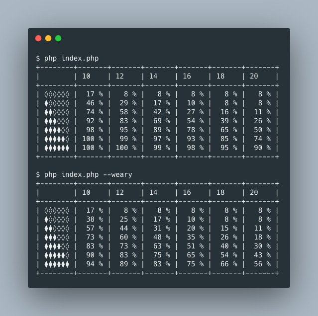

<p align="center">
    
</p>
<p align="center">
    Success rates for <a href="https://en.wikipedia.org/wiki/The_One_Ring_Roleplaying_Game">The One Ring Roleplaying Game</a>  (version 1).<br>
</p>

## Status

This application is now considered as stable.
No more features are planned, but feel free to suggest some if you need.

## Requirements

- PHP >= 7.4.

## Deployment

1. Download the code to an empty folder:
```bash
git clone https://github.com/simondubois/sdalau.git /var/www/sdalau
```
2. Install the dependencies:
```bash
cd /var/www/sdalau && composer install
```

## Usage

```bash
php index.php # for non weary character
php index.php --weary # for weary character
```

## Note

- All results are rounded to the nearest whole percentage.
